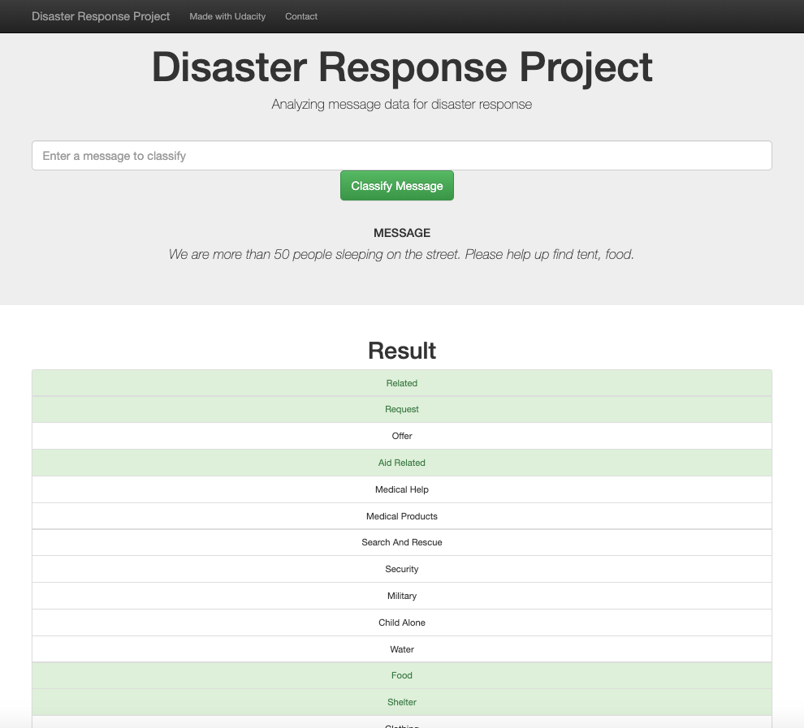
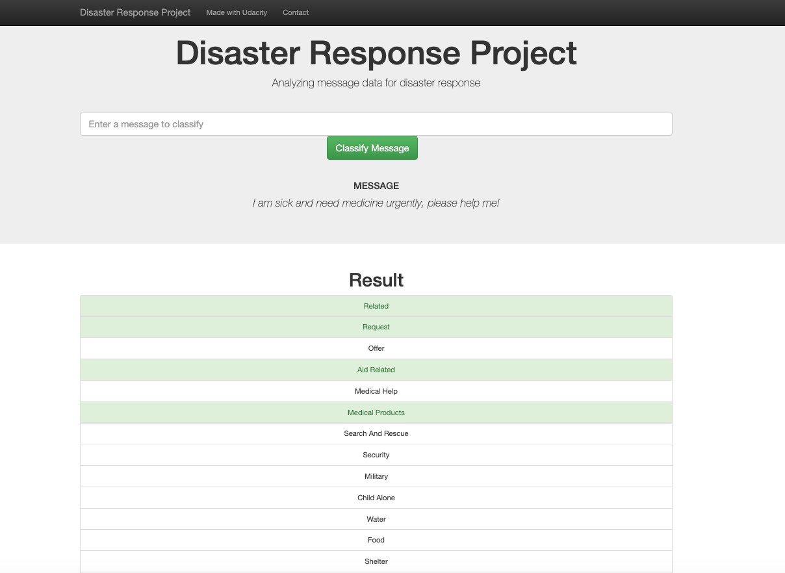
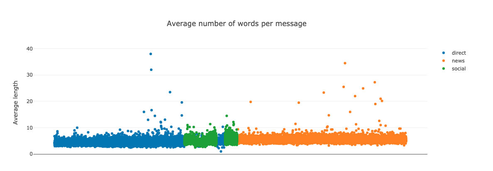
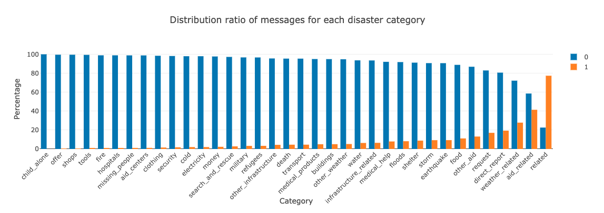
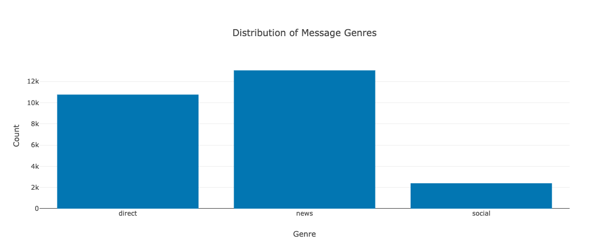
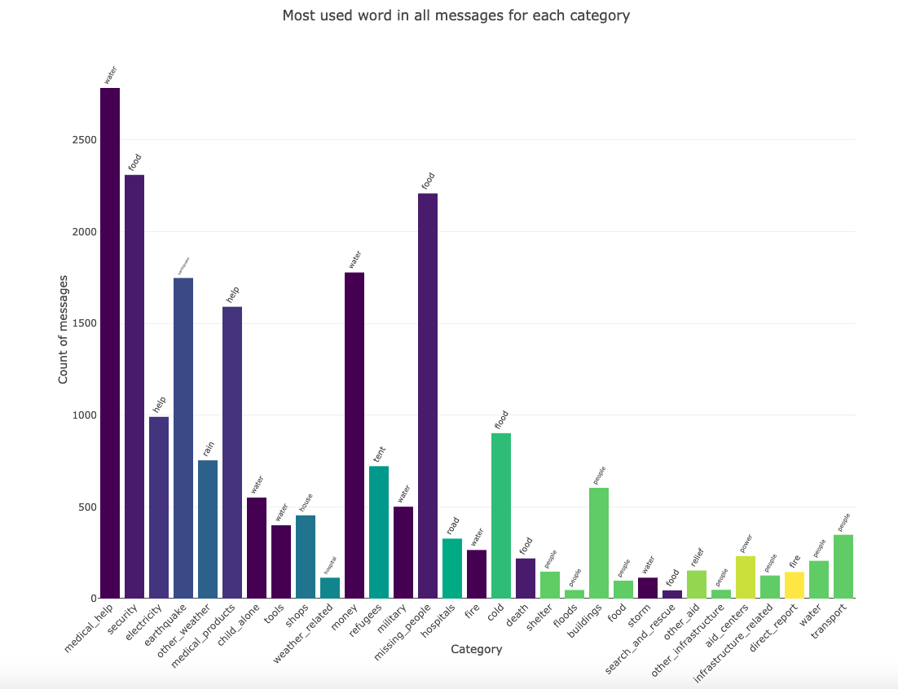
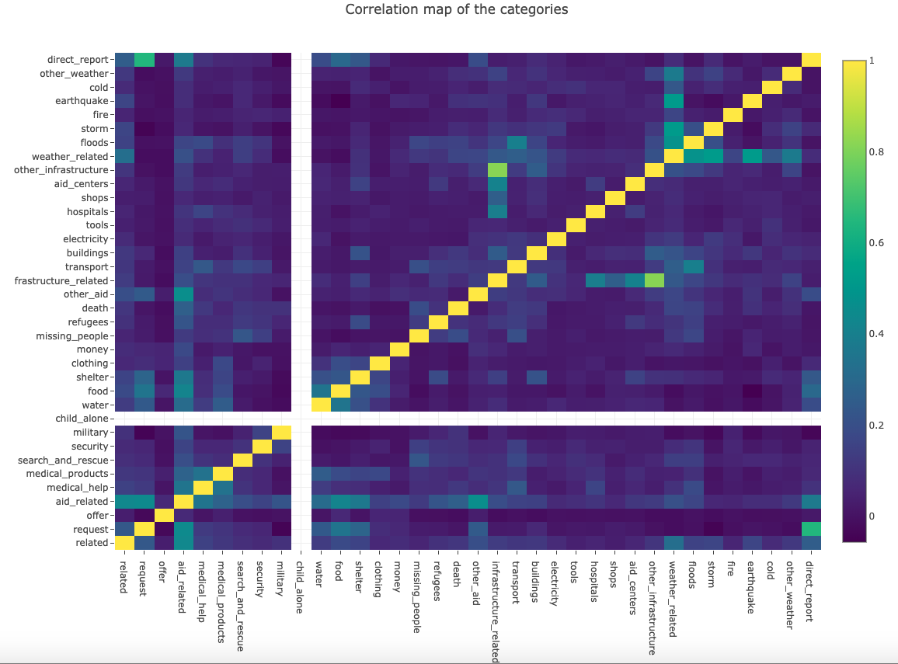
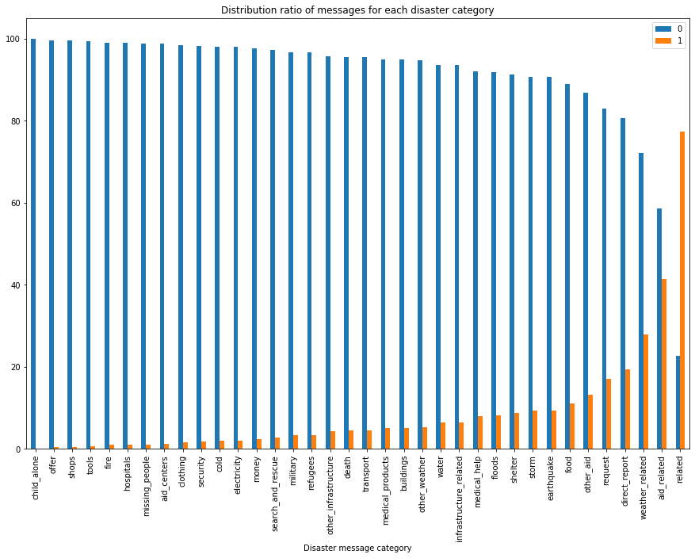

Disaster Response Classifier
==============================

Purpose of this project
-----------------------

This is a supervised learning classification project. 
Using pipelines (ETL and ML pipelines), a multi-output Random Forest Classifier was trained on the data after applying NLP techniques. 
A web app is available as an interface to use the ML model to predict the class of an inputted message and provide visualizations on the training data.
The focus of this project is the classification of messages sent during of after a disaster to the appropriate category (ex: water, shelter, fire, hospital...). The goal behind is to be able to assist forwarding the message to the appropriate recipient and therefore ensure a more efficient assistance of people concerned by the disaster.

In this repository, you will find:

- Two Jupyter notebooks that go through the process of defining the pipelines (ETL and ML pipelines)
- A folder containing the script to execute the ETL pipeline
- A folder containing the code related to training and saving the model
- A folder containing the files necessary to display the web app
- A folder containing the data (csv inputs and database)
- This readme file

Requirements
------------

The code is written in Python 3.7.

There are several dependencies for this package. The versions provided here are those used for testing.

- argparse 1.1
- bokeh 1.3.4 (for coloring of the visualisations)
- json 2.0.9
- nltk 3.4.4
- numpy 1.16.4
- pandas 0.25.0
- pickle 4.0
- plotly 4.1.1
- os 
- re 2.2.1
- sklearn 0.21.2
- sqlachemy 1.3

How to use the code
-------------------

There are two approaches on how to use this code:
- use the model as it is to predic the class of one or more messages
- train a new model with new data

In the case of the first approach, please take a look at the next section regarding the web app.
As for the second approach, there are several steps:
1. Execute the script process_data.py, passing as arguments:
	- the path to the disaster_messages.csv file
	- the path to the disaster_categories.csv file,
	- the path or name of the database where to store the data once processed 
2. Update the conf.json file to set the parameters of the train_classifier.py script
3. Execute the script train_classifier.py, passing as arguments:
	- the path or name of the database where to store the data once processed 
	- the path or name of the pickle file of the saved ML model

General comments about the process_data.py script:
- the loading of the data takes into account the fact that other formats can be provided for the messages and categories files (for example json, xml or tables of a db)
- the transformed and merged data is saved in a table named 'MessagesWithCategory' by default, which can be changed directly in the main() function of the code of the script

General comments about the train_classifier.py:
- It is structured as to allow flexibility in the way the model should be trained - parameters are set in a conf.json file allowing the user to fine tune which hyperparameters to use for CountVectorizer and RandomForestClassifier, as well as whether to use more advanced NLP transformers and grid_search
- In order to avoid needing to always train a model from scratch, if the pickle file provided as an argument exist (i.e a model was already saved), the model saved is used as a base for **further** training - the hyperparameters set in the conf.json file should therefore be chosen in consequence!
- If the model saved includes GridSearch, a message is displayed to the user emphasizing the 

Web app
-------

The web app is structured in two parts:
- the query section
- the visualisations on the training data

The query section allows a user to input a message and get the prediction of its category using a trained model.

For example, if we input the message "We are more than 50 people sleeping on the street. Please help up find tent, food.", we get:

Or the message "":

Note that the user input is tokenized to ensure maximum performance of the model.

The visualisation of the training data provides an insight on:
- the distribution of message length

- the imbalance of classes

- the number of messages for each genre (news, social, direct)

- the most popular word in messages for each category

- the correlation between categories

As to increase performance when loading the web app, most of the data needed to produce these visualisations is computed when training the model (option available in the conf.json file). The dataframes used are saved along with the pickle file of the model. 

Comments on the data
---------------------

Imbalance of class and data modeling choices
---------------------------------------------

The data used to train the model is clearly imbalanced: only a small percentage of the messages were labeled with each class, which makes both the interpretation of the overall accuracy and the accuracy of the model's prediction more difficult to evaluate. 
This is why when building our model we paid attention to:
- using a ML model that is not too sensitive to imbalanced data, with in particular a hyperpamater (boostrap=True) that ensure data sampling
- using a metric that is less sensitive to imbalanced data than accucary: the F1-score

Besides, to evaluate the performance of a model of a set of hyperparameters we focused on the score of the categories on the far right of the graph above, those categories that had enough values on both classes. 

Data cleaning
--------------

The data cleaning process actually occured at two different moments:
- in the ETL pipeline, when transforming the data from one source into another format to be able to merge it to the data of the other source prior to loading it into the database
- in the ML pipeline, when applying NLP techniques to engineer new features to be able to train the model

The cleaning in the first pipeline is rather straight forward: the categorical data was encoded, allowing vectorization later on.
Regarding the NLP techniques used, here are the methods implemented:
- Tokenization -> removal of punctuation, stopwords, URL and capital letters, lemmatization, to reduce each message to a list of roots of the most meaningful words
- CountVectorizer, with ngram_range set to (1, 2) instead of (1,1) -> vectorization of the list of words of each message
- TF-IDF with the default parameters -> adding a weight to each occurence count of a word based on how many documents use this particular word
- Custom tranformers:
	- calculate the average word length of each message
	- calculate the number of words and stop words of each message
	- compute the number of words of each message that are associated with each category (by looking at the category of each message in which a given word is used)

The first 3 estimators are used by default in the ML pipeline, while the custom transformers are used only when setting full_txt_process to True in the conf.json file. 

Further work and improvements
-----------------------------

Some improvements that could be performed on the code of this project:

- use a conf.json file for the process_data.py script as well
- find a way to run GridSearch with n_jobs=-1 (and not only the classifier RandomForest)
- fine tune better the estimators hyperparameters as to keep the same level of accuracy but reduce process time
- one function (word_count_per_cat), used when setting full_txt_process to true, takes a long time to run - could be optimised

Sources, acknowlegments and related content
-------------------------------------------

The dataset used in this project was provided by Figure Eight.
This project is part of the UDACITY Data Scientist Nanodegree.

